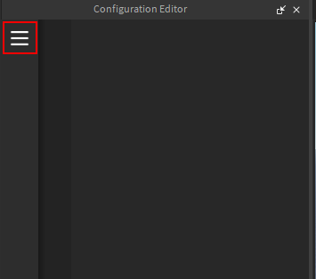
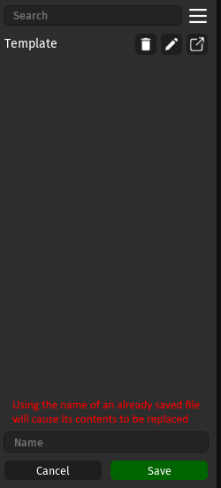
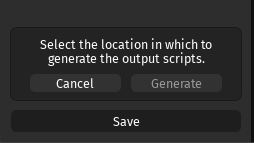
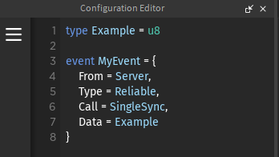

# Studio Plugin
#$ Navigating
After installing the plugin locate it within your plugin tab in Studio.
!!! note
    After opening the plugin you will be prompted to give it access to inject scripts, the plugin needs this in order to generate the output files.  

## Menu
!!! tip
    You can open the side menu using the sandwich button on the left hand side.
  

Within the menu you can manage your network description files.
  

## Saving
To save a network description simply press the save button at the bottom of the side menu.   
This will prompt you to save whatever is currently in the editor.
!!! tip
    You can save to already existing files by simply inputting their name

  

## Generating
To generate your networking modules simply press the "Generate" button on your desired file.  
This will open a prompt asking you to select your desired output destination within the game explorer.  

 

Once you've selected your desired output destination simply press "Generate" and your files will be ready.  

 

If no issues arise Blink will generate the following Folder containing your networking modules:  

 

## Editor
  
   
!!! tip
    Invalid syntax will be highlighted in red or underlined.  
    

## Errors
Upon generating output files, Blink will parse the source contents and inform you of any errors within your files that are blocking generation.  

> 